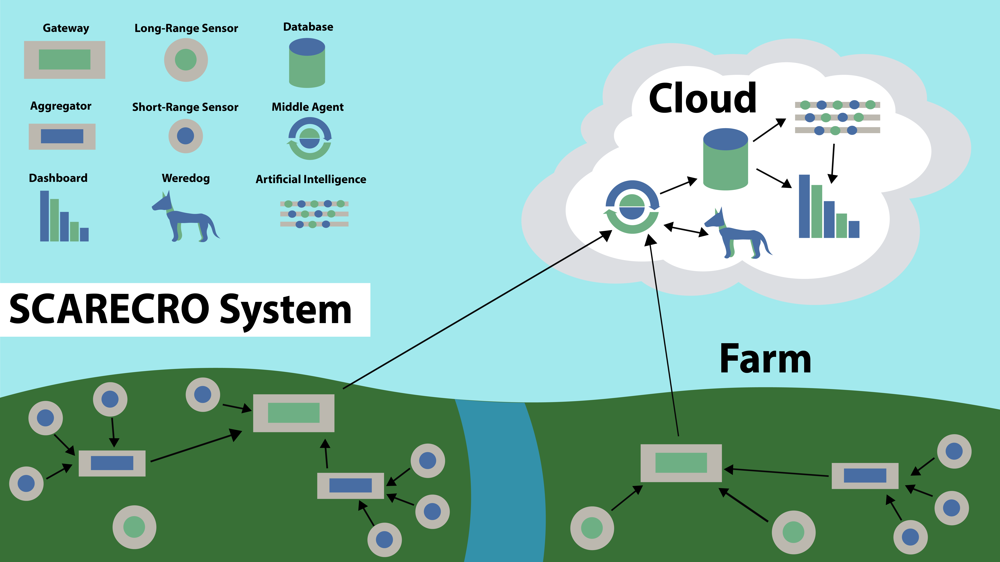

# Data Gator

Welcome to the home of the Data Gator! This organization hosts the hardware design files, firmware, and documentation for each. Check out the table of contents below for quick links
to helpful information!

| Link | Description |
| :---: | :---: | 
| [data-gator.github.io](https://data-gator.github.io) | Main documentation, go here! | 
| [Doxygen Firmware Documentation](https://data-gator.github.io/doxygen_firmware_docs/) | Documents firmware API and configuration variables used in production firmware. |
| [Hardware Documentation](https://data-gator.github.io/Hardware)| Documents hardware components, manufacturing, and assembly process. Also has design files. |
| [Legacy Documentation](/profile/documentation/README.md) | Legacy documentation for the project. Under revision and restructuring. Come here to find high level documentation (flow charts, etc). |

# What is a Data Gator?

The Data Gator is an embedded system solution for wireless sensor integration and network extension. It is a custom PCB with an ESP32, uSD card holder, and various ports for sensors. In the diagram below, DGs serve as [_**Aggregators**_](https://github.com/Project-VineHeart/scarecro#aggregator), collecting data from sensors and relaying it to [_**Gateways**_](https://github.com/Project-VineHeart/scarecro#gateway) which store the data in a cloud database. From there the data is available to the user.

##### Hardware Features:
* Latched Molex/JST connectors for analog and I2C sensors **without soldering** 
	* All that is needed is the compatible connector receptacle, crimp socket connectors, a pair of wire strippers, and a pair of crimping pliers. Materials and assembly guides can be found under hardware documentation (linked above).
 * Micro-SD card holder for offline data collection and recovery
 * Discrete Analog to Digital Converter (ADC)
	 * implemented to fix stepping issues in ESP32's integrated ADC
 * Watch Dog Timer for timing and system recovery
 * Fuel Gauge for monitoring battery charge state
 * DIP Switch for firmware mode configuration
 * _optional_ Solar Charger for self-sustainable operation outdoors year-round
	 * sustainability is based on an average of 3 sunny days per week
* _optional_ u.FL connector so that an external antenna can be attached to extend WiFi range

##### Firmware Features: 
* Supports a variety of affordable, durable, and accurate sensors
* Micro-SD card holder and automatic timestamped data collection
* Over-The-Air Updates for remote firmware management
* Human readable firmware configuration system with documentation
* Unit tests for testing hardware integrity
* Documentation hosted through Github can be used to add support for new sensors or reconfigure the device for new use cases! For questions, contributions, and troubleshooting related discussion please create an issue.

#### What does it look like?
The picture below is of a fully assembled Data Gator board, hardware revision version 1.5, ready to be connected to sensors, a battery, and a solar panel.

Here the various interfaces are denoted with example pictures of some sensors which are supported with this board.

Finally, the Data Gator board can be placed in a generic water-proof enclosure and setup outdoors to collect data. Cable glands are installed in the side of the box for sensor cables and a SMA connector is placed in the side of the box on the top right to allow WiFi range expansion with a cheap off-the-shelf antenna.
